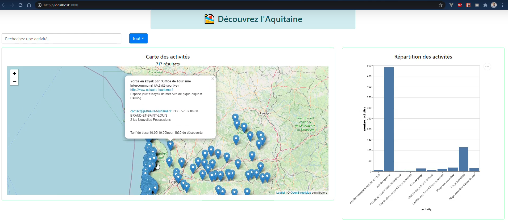

# Découvrez l'Aquitaine

Group project to discover beach activities in Aquitaine using an Elastic Search-based React app.



**[Watch a video showing off the app here!](https://drive.google.com/file/d/1X08GaSdhE1-JSKdCt7YIBH3LwGX-fTWF/view)**

Please find the report (answers to questions and screenshots) for the labs 1 to 3 in `report-lab-1-2-3.pdf`.

Group members : Nicolas Boussenina, Nicolas Oulianov, Julien Liu

## Installation

### 1. Allow Elastic search to communicate with the app

In the `elasticsearch-7.10.0/config/elasticsearch.yml` configuration file, add the following lines somewhere:

```
http.cors:
  enabled: true
  allow-origin: /https?:\/\/localhost(:[0-9]+)?/
```

This will allow Elastic Search to communicate with the local app.

### 2. Import the dataset into Elastic Search

Launch Elastic Search and Kibana. 

In Kibana, go to the *Machine Learning > Data Visualizer* section, and follow the instructions to import the newline delimited json file `data/plages.json`. [Look here for more details](https://www.elastic.co/blog/importing-csv-and-log-data-into-elasticsearch-with-file-data-visualizer). 

Don't change the suggested column names. On the next screen, however, you are prompted to create an index. Name the index `beach` and, in *Advanced Options*, specify the following mapping :

```
{
  "properties": {
    "@timestamp": {"type": "date"},
    "adresse": {
      "type": "text",
      "analyzer": "french"
    },
    "code_postal": {"type": "long"},
    "commune": {"type": "keyword"},
    "date_derniere_maj": {
      "type": "date",
      "format": "dd/MM/yyyy"
    },
    "description": {
      "type": "text",
      "analyzer": "french"
    },
    "id": {"type": "keyword"},
    "latitude": {"type": "double"},
    "longitude": {"type": "double"},
    "mail": {"type": "keyword"},
    "nom": {"type": "text"},
    "ouverture": {
      "type": "text",
      "analyzer": "french"
    },
    "site_web": {"type": "keyword"},
    "tarifs": {
      "type": "text",
      "analyzer": "french"
    },
    "tel": {"type": "text"},
    "tel_mob": {"type": "text"},
    "type": {"type": "keyword"},
    "location": {"type": "geo_point"}
  }
}
```


### 3. Install javascript 

Make sure you have a recent version of `nodejs` and `npm` installed.

If you need to update nodejs, I suggest you do it using `nvm`. [This guide will take you through](https://dev.to/skaytech/how-to-install-node-version-manager-nvm-for-windows-10-4nbi). 

### 4. Install the javascript dependencies

Go to the my-app repository.

```
cd my-app
```

Install dependencies. 

```
npm i
```

## Run the app

First, make sure the Elastic Search is running. If not, run it.

```
./elasticsearch-7.10.0/bin/elasticsearch
```

Compile the code and start the server.

```
npm
```

Then go to `localhost:3000` in your browser and access the app. Congratulation, you can now discover all the beach activities in Aquitaine!

## Credits

We used [this public dataset](https://www.data.gouv.fr/en/datasets/liste-des-plages-et-activites-de-plage-en-aquitaine-4/) for the project.